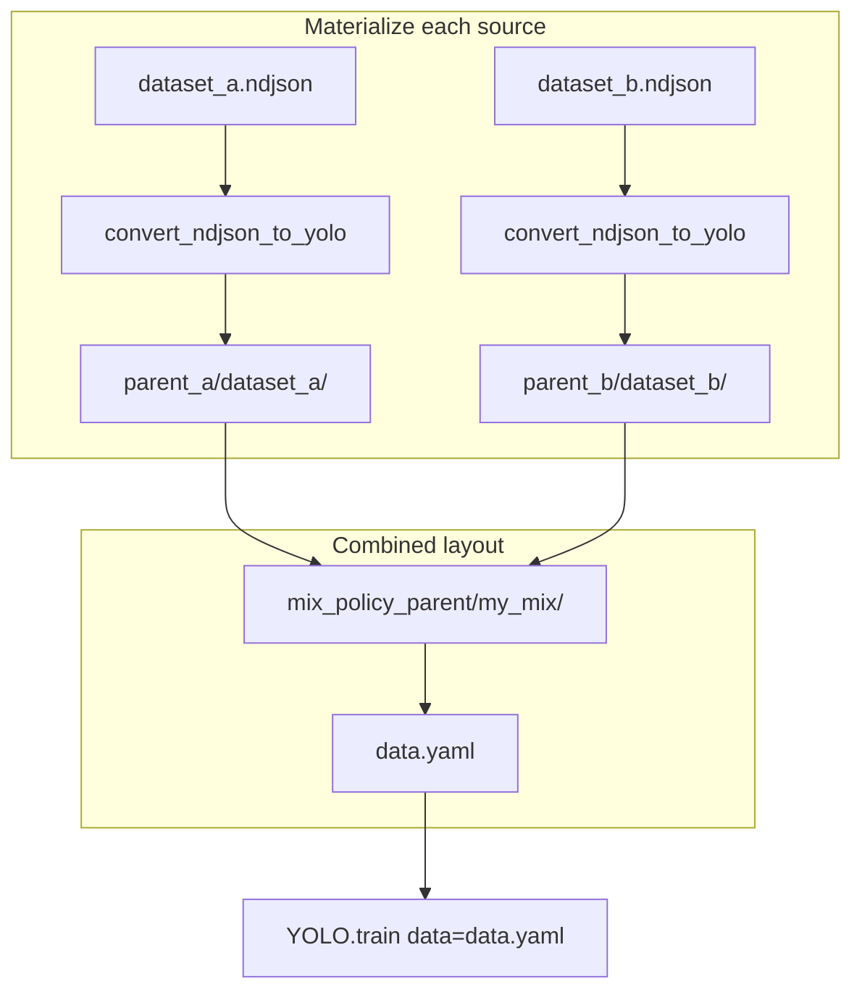

# Skill: YOLO (Ultralytics) NDJSON — multi-source cache, symlink mix, and refresh

A reusable pattern for training **Ultralytics YOLO** models when the training set is defined as **several NDJSON files** that you want to combine, without re-downloading and re-converting everything on every run.

This document is **framework-agnostic at the concept level** (any training entrypoint can implement the same steps). The concrete APIs mentioned are those exposed by **Ultralytics** (for example `convert_ndjson_to_yolo`, `YOLO.train`).

---

## When this applies

- You use **NDJSON** datasets (first line: dataset metadata; following lines: one JSON object per image, often with remote `url` fields).
- You train from a **mix** of multiple NDJSON files (a policy list: source A, source B, …).
- You observed that passing a **new merged NDJSON path every run** (for example a random tempfile) forces a **new output directory name** and defeats the library’s on-disk cache.

---

## Core problem

Ultralytics materializes NDJSON into a YOLO layout under:

`output_path / <ndjson_file_stem>`

It also stores a **content hash** (excluding volatile URL query strings) in `data.yaml` to skip reconversion when nothing changed. If `<ndjson_file_stem>` changes every run, that directory is always new: **no hash hit**, full conversion and image downloads repeat.

---

## Pattern: prefetch + symlink mix

**Idea:** Give each **source NDJSON** a **stable identity** (typically the file stem). Materialize each source once. Then build a **combined** dataset directory whose `images/` and `labels/` are **symbolic links** into those materialized trees, and point training at **one** `data.yaml` in that combined directory.

Benefits:

- Per-source dirs are stable → **hash-based skip** works across runs.
- The combined view does not duplicate image bytes → **symlinks only**, cheap to rebuild each run if needed.
- Training receives a normal **YOLO `data.yaml`**, not a merged NDJSON blob, so the trainer does not run NDJSON conversion on a huge merged file.



**Default layout (typical):** pass `output_path = dirname(ndjson)` so the library writes to **`<ndjson_dir>/<ndjson_stem>/`** (e.g. `data/foo/bar.ndjson` → `data/foo/bar/`). Place the symlink mix beside the mix policy file: **`<mix_yaml_dir>/<mix_stem>/`**. Optionally, a single **override root** can reproduce the older pattern `override/<ndjson_stem>/` and `override/<mix_stem>/`.

### Steps (implementation outline)

1. **Resolve** each entry in your mix policy to an absolute NDJSON path (order matters if you merge metadata from the first file only).
2. **Materialize** each NDJSON with `convert_ndjson_to_yolo(path, output_path=...)`. With the default above, use `output_path = path.parent` so materialized data lives next to the NDJSON. That yields `images/{split}/`, `labels/{split}/`, and `data.yaml` under `<ndjson_parent>/<ndjson_stem>/`. Missing images are downloaded from `url` when required.
3. **Build** the mix directory: for every image record in every source, create **relative** symlinks from the mix tree into the corresponding materialized files (paths depend on where you placed each source tree and the mix folder).
4. **Emit** `mix/data.yaml` with `task`, `names` (consistent with your merge rules — often taken from the **first** source’s header), and `train` / `val` / `test` paths relative to the mix directory.
5. **Train** with `data=<absolute_path_to_mix/data.yaml>`.

---

## Prefetch (terminology)

Here “prefetch” means **ensure materialized YOLO trees exist** for each source NDJSON before building the mix. It is not a separate protocol: it is the **same conversion** the framework would run for a single-dataset path. Any logic that downloads only when files are missing stays inside that conversion.

---

## Refresh: invalidate cache

Expose a **boolean** (CLI flag and/or config) meaning: **delete cached materialization** and rebuild.

A typical policy when refresh is **true**:

- Remove the **combined** mix directory (e.g. `<mix_yaml_dir>/<mix_stem>/` when using the default layout).
- Remove each **per-source** materialized directory (e.g. `<ndjson_parent>/<ndjson_stem>/` for every policy source).

If you use a single **override root** instead, delete `override_root/<mix_stem>/` and each `override_root/<source_stem>/`.

Then rerun materialization and symlink creation. Use this after re-exporting NDJSON from a platform, rotating assets, or debugging corrupted files.

**Note:** If your CLI merges YAML with “only set keys that were passed,” booleans need care: `refresh=false` on the command line must not accidentally override `refresh=true` in a file. Many CLIs treat `--refresh` as explicit opt-in.

---

## Optional: stable merged NDJSON (without symlink mix)

If you only concatenate NDJSON lines into one file for debugging or external tools, **write that file to a stable path**, for example:

`…/cache/mix/<mix_name>/merged.ndjson`

so that if you ever train directly on merged NDJSON, `datasets_dir/<stem>` stays stable. This does **not** remove duplicate downloads inside a **single** merged directory unless you also rely on hash skip; the **symlink** approach avoids duplicating bytes between per-source and combined layouts.

---

## Constraints

| Topic | Guidance |
|--------|----------|
| **Filename uniqueness** | Symlink mix usually keys on `(split, basename)`. Collisions across sources break or require renaming. |
| **Class map** | All sources must agree on class IDs if you use one merged `names` block (often from the first dataset header). |
| **Symlinks** | On Linux/macOS they are standard. On Windows, symlink creation may require developer mode or admin rights; fall back to copies or junctions if you must support restricted environments. |
| **Single NDJSON** | Training with one NDJSON path only does not require this pattern; the library’s own caching applies to `datasets_dir/<that_stem>`. |

---

## Configuration surface (generic)

Typical reserved keys for a thin training wrapper (not passed through to `model.train`):

| Key | Role |
|-----|------|
| Path to mix policy file | Lists NDJSON sources (and optional weights for future sampling). |
| `dataset_output_dir` / equivalent | Optional single root for all trees (`<root>/<stem>/`). If unset, keep data next to each NDJSON and the mix next to the mix policy file. |
| `refresh_data` | If true, delete mix and per-source dirs under that root before rebuild. |

Everything else (`epochs`, `batch`, `model`, …) passes through to the framework.

---

## Minimal CLI sketch (illustrative)

```bash
python train.py --config train.yaml --mix configs/my_mix.yaml
python train.py --config train.yaml --mix configs/my_mix.yaml --refresh-data
python train.py --config train.yaml --mix configs/my_mix.yaml --dataset-output-dir /data/yolo_cache
```

Adapt to your project’s module names and config layout.

---

## Summary

- **Stable stems** for source NDJSON materialization enable **cache reuse**.
- **Symlink mix** combines sources **without** duplicating images and **without** feeding a merged NDJSON into conversion each time.
- **Refresh** wipes known cache directories so the next run fully reconverts and re-fetches as needed.
